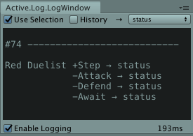

# Active Logic FAQ

## What is main difference between active-logic-cs (on Github) and the Unity Asset store package?

The Github repository is licensed via GPL-Affero, whereas the store package is covered by the store's end user license agreement (EULA); if your project is not open source, get the store package.

## Technically speaking, is the Github version different from the asset store package?

The Github version does not depend on the Unity platform. Its purpose is to avail core functionality to the C# community at large.

The Unity integration offers additional features:

- Interactive visualization of behavior trees at runtime, provided your code is correctly annotated, and your behavior trees are managed via dedicated components.
- Visual history analyzes behavior over time.
- Dedicated components for rooting and managing your behavior trees. This includes 'steppers' for update loops (Agent, PhysicsAgent and Stepper) and task components (UGig, UTask) derived from MonoBehaviour

The Gihub repository is not intended as a 'light version' of the store package; compatibility across Mono, .NET and .NET Core enables other integrations.

## With UGig and UTask, do I need to make every task a component?

No. You should use status expressions and status functions alongside Gig, Task (objectified tasks not inherited from MonoBehavior) and UGig, UTask.

To understand how this all fits together, consider that a behavior tree is a hierarchic structure. A tree has roots, branches and leaves.

In Active Logic you do not need a component or objectified task to form a behavior tree, however:
- If you have a behavior tree not associated with a component or stepper, you cannot directly attach it to a game object, and no output is seen in the log-tree view.
- Gigs and tasks provide features which cannot be availed using only status expressions. For example you can use a decorator in a status function, but for most decorators they are managing data, which needs to be stored somewhere.

## What is the difference between Active Logic's logger/debugger and Prolog?

[Prolog](https://github.com/active-logic/prolog) is a general purpose, automated logger for C# and Unity. As such it relies on Mono.Cecil, and has dependencies on Unity's build system. Prolog visualizes function calls chronologically, either globally, or on a game object basis.

In contrast the integrated logger/debugger requires annotating your code. This approach means that it is less reliant on details of the build system, or external libraries. The integrated logger also lets you visualize behavior trees as hierarchies of tasks and subtasks.

In the near future, Prolog will support debugging (breakpoints, stepper, visual history) features similar to the integrated logger. Depending on demand and community support, hierarchic views (stack-trees) may also be provided (hopefully, early 2020).

Eventually, I expect that most Unity developers will prefer Prolog over the integrated logging/debugging feature.

I developed these tools because I believe that providing dedicated feedback is integral to the workflow when working with behavior trees; in the forseeable future there is no plan to deprecate either.

## What are `GigLogging.cs` and the Active Console?

GigLogging and the Active Console provide support for a logging method which later proved redundant with and lesser than, Prolog. This will be removed from a future release.

## What are plans for future development?

Active Logic stemmed from a desire to provide an outstanding BT library, specifically for C# programmers. The library has been very carefully designed and implemented - the obvious step now is to evangelize and listen. I want to hear what programmers have to say about this library, and this I would expect will deeply impact future development.
