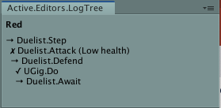

*Reading time: 12 minutes - Last Updated: 2020.11.27*

# Active Logic for Unity - Quick start guide

Be welcome! Here is a hands-on introduction to Active Logic. This guide is suitable for the following distributions:
- [Active Logic](PENDING_URL)
- [Active-LT](https://github.com/active-lt)

Features only available in Active Logic are marked with the [PRO] label; if you are upgrading from Active-LT, [read here](Upgrading.md).

This guide assumes some familiarity with Behavior Trees. For a gentle introduction follow the [Frogger tutorial](https://github.com/active-logic/active-lt-demos/tree/main/Frogger).
For a comprehensive introduction to behavior trees, we recommend [this book](https://btirai.github.io).

*Reading offline? You may be looking at an out of date version of the guide; for up to date, comprehensive documentation, visit*
https://github.com/active-logic/activelogic-cs

## Namespaces and scopes

- Avail Active Logic `using Active.Core`
- For keywords use either `static Active.Raw` or `static Active.Status`

```cs
using Active.Core;
using static Active.Raw;  // using static Active.Status;

// ...
```

## Status expressions

Throughout this guide we consider the example of a basic 'soldier' AI or agent. A soldier may attack, defend or retreat; in AL this is modeled using a *status expression*:

```cs
status s = Attack() || Defend() || Retreat();
```

The above realizes a *fallback strategy* (aka *selector*), reading:

```
If possible, attack;
otherwise, defend;
otherwise, retreat.
```

A `status` may be `complete`, `failing` or `running` (for 'continue'). a value of *running* causes execution to *yield* until the next iteration.

Status expressions are invoked *frequently*; below, status expresssions are used via `MonoBehaviour`:

```cs
using UnityEngine;
// Typical AL imports
using Active.Core;                // Core API.
using static Active.Core.status;  // Static import for 'done()'
                                  // instead of 'status.done()', and
                                  // so forth.

public class Soldier : MonoBehaviour{

    public status state;

    void Update(){
        state = Attack() || Defend() || Retreat();
        if(!state.running){
            enabled = false;
        }
    }

}
```

The above iterates frame by frame until `state` changes to *failing* or *complete*.

Instead of `MonoBehaviour`, we recommend using `UGig` or `UTask`:

```cs
public class Soldier : UGig{  // or `Gig`

    override public status Step(){
        return Attack() || Defend() || Retreat();
    }

}
```

When assigning or returning a status, use `done()`, `fail()` or `cont()`:

```cs
status Attack() => hasWeapon ? fail : Play("Strike");
```

AL does not restrict status expressions to sequences and selectors
(here we used the ternary conditional `x ? y : z`).

**NOTE**: *status does not convert to `bool`; instead, query the `running`, `failing` and `complete` status properties; booleans do convert to status (where* true *is* done, false *is* failing *).*

In a status expression, terms evaluating to a status are referred as *tasks* or *subtasks*:

```cs
A && B || (C && D)
```

Visual BT presentation:

```
    ⍈
    |
+---+----+
|        |
A        ⍰
         |
     +---+---+
     |       |   
     B       ⍈
             |
         +---+---+
         |       |
         C       D
```

In the above diagram, `C && D` realize a subtask. Following operator precedence, `B || (C && D)` is also a task.

Initially, mixing `&&` and `||` may be confusing. If so, write simple status expressions and define new C# functions for subtasks.

**A key to understanding behavior trees** is that a later task (such as `Retreat`) - does not evaluate before ticking (traversing) prior tasks (in our example, `Attack` and `Defend`). For this reason, a dependable status function often requires guard conditions:

```cs
status DoSomething(){
    if( CANNOT_DO    ) return fail;  // guard A
    if( ALREADY_DONE ) return done;  // guard B
    return REALLY_DO_SOMETHING;
}
```

*Over-exercising* (ticking a done task) and *over-checking* (ticking a failing task) are integral to BT, ensuring *responsiveness*.

Let's say a soldier dropped their sword. In BT, how would the following sequence handle this?

```cs
status Attack() => Strike() || EquipWeapon() || PickupWeapon();
```

Gotcha! They will pick up their sword again (or perhaps unsheath a dagger). This is neat and depends on correctly implemented guard conditions.

Guard conditions work best when you leverage agent/world state (is a weapon equiped? Is it in the inventory? Is there another weapon within a 3 meter range?).

Status expressions implement *stateless* control. In our toy model/example this approach is beneficial: depending on how `Attack()` is implemented, a wounded agent may also receive healing and get back on the offense. Here is another possible implementation of the `Attack()` function:

```cs
status Attack(){
    if(health < 25) return fail;
    if(!threat)     return fail;
    return MoveTo(threat) && Strike(threat);
}
```

Notice the `MoveTo(threat) && Strike(threat)` idiom. The conditional operator AND (`&&`) behaves differently from the conditional OR (`||`). In this case an attack will not complete until *both* `MoveTo` and `Strike` did succeed.

If correctly implemented (using guard conditions), ticking `MoveTo` while within striking range will not interfere with the strike task.

Expressions of the form `EXP_1 && ... && EXP_n` are known as *sequences*; use a sequence when each task is a prerequisite to the following task.

More generally, selectors and sequences are known as *composites*.

In all, status expressions and status functions combine to form behavior trees.

## Status keywords

Status keywords include `done`, `cont` and `fail`. Throughout documentation and examples you will see either of the following:

- The raw, unadornated form such as `done`
- Logging calls, such as `done()` or `done(log && "For no reason")`

Raw constants are slightly faster, and require using *Active.Raw*. Logging calls are available via *Active.Status*, and capture useful debugging information, along with custom messages.

Within the same project, you may use either *Active.Raw* or *Active.Status*. Ordinarily, logging calls are recommended, unless one of the following is true:

- You are running AL in a physics loop and/or really need to maximise performance
- You are using a test oriented workflow (then perhaps you do not need the logging/visual history features)

## Decorators [PRO]

In the above example we hinted at a `Strike()` task. Effective control requires a variety of small 'utilities' used to modulate behavior. A staple of video game design, the cooldown is one such thing:

```cs
status Attack(){
    // guards omitted for brevity ...
    return Engage(threat) && Cooldown(1.0f)?[ Strike(threat) ];
}
```

AL magic lets you invoke stateful decorators without explicitly allocating storage (With a cooldown for instance, a date stamp is stored, so we know when the cooldown has expired).

With the above syntax, decorators are supported via `Task` and `UTask` (aka "stateful contexts"); if you are not using decorators, prefer `Gig` and `UGig`.

AL offers several [built-in decorators](Reference/Decorators-Builtin.md) and you may also [craft your own](Reference/Decorators-Custom.md).

## Ordered Composites [PRO]

Stateless control encourages you to leverage world/agent state as the primary drive for behavior. This works well, and often reduces bugs.

However some design problems do not fit this approach; consider this:

```cs
status s = Taunt(target) && Reach(target);
```

A *taunt* is air. It may instill fear in the enemy's heart, or could be a thing your game designer want for added emphasis. Either way your model may or may not be tracking state changes related to uttering warcries.

When an actor are intended to follow a sequence of steps *by design*, use an ordered composite:

```cs
status s = Seq()
    + @do?[ Taunt(target) ]
    + @do?[ Reach(target) ]
    + /* ... */ ;
```

The above syntax is available in stateful contexts (`Task` or `UTask`). Once again this is because ordered composites use control state (here, an integer tracks the currently running task)

By default, an ordered sequence runs until either a failure is encountered, or all tasks have succeeded, thereupon the ordered sequence resets.

If you do not wish an ordered sequence to reset, use `Seq(repeat: false)`

Above, the `@do?[ EXP ]` node spans a unique function call. You may embed a stateless selector/sequence or indeed any other status expression.

Ordered selectors use a similar syntax:

```cs
status s = Sel()
    - @do?[ Taunt(target) ]
    - @do?[ Reach(target) ]
    - /* ... */ ;
```

**NOTE**: *decorators and ordered composites add control state to your logic. Overusing stateful control reduces the responsiveness and resilience of your agents, whereas responsive, environment-aware agents draw current information from world state.*

## Tasks and frame agents

We have already encountered `UTask`. In Active Logic, `UTask` is a handy base class derived from `MonoBehaviour`. Let's define a task for the `Soldier` role:

```cs
using Active.Core;
using static Active.Raw;

public class Soldier : UTask{

    float health = 100;

    override public status Step()
        => Attack() || Defend() || Retreat();

    status Attack() => threat && health > 25
        ? Engage(threat) && Cooldown(1.0f)?[ Strike(threat) ]
        : fail;

    // status Defend() => ...

    // status Retreat() => ...

}
```

Because `Soldier` inherits from `UTask`, it is also a Unity component which may be added to the Unity inspector. In the same way that `Update()` is present in many subclasses of `MonoBehaviour`, `Step()` is our entry point for BT-styled update loops.

A task **does not run on its own**.

To make the above runnable, add an `Agent`. Then, in the agent inspector, add `Soldier` as root (if you forget, this happens automatically).

**Uses of task objects**

in AL, task objects are used in several ways:

When writing a low level module (such as locomotion, or a collection of game actions), prefer `Task` or `Gig` to `UTask`, `UGig` (even when using Unity).
Then you do not override the `Step()` function. Instead you provide a collection of status functions such as `status Walk(...)` and `status Jump(...)`; another task will then invoke these functions directly.

When designing high level behaviors, such as *roles* (say `Farmer` or `Soldier`), override `status Step()` and perhaps expose the task in the inspector via `UTask` (for parameterization). In such cases there is no need to explicitly invoke the step function:

```cs
class Citizen : UGig{

    bool employed;
    GateKeeper gateKeeper;  // derived from Task or UTask
    Thief      thief;       // derived from Task or UTask

    // gateKeeper.Step(), thief.Step() via implicit conversion
    override public status Step() => employed ? gateKeeper : thief;

}
```

In the above example, `UGig` is used since neither decorators, nor any ordered composite(s) are needed.

The above example also suggests how you compose versatile agents by assembling ever larger BTs, combining OOP's delegation pattern with BT's modular control paradigm.

## Logging and the Log-Tree

Active Logic's logging features are helpful, in that the behavior of complex agents is not transparent, and tracing loops running at 10~60Hz in the console is not practical.

In Unity, access the Log-Tree window from the *Window* menu; then, enable logging from the Agent inspector.

For useful output, we annotate the soldier script:

```cs
using Active.Core;
using static Active.Status;  // Active.Status for logging calls

public class Soldier : UTask{

    float health = 100;

    // Wrap status expressions with 'Eval'
    override protected status Step() => Eval(
        Attack() || Defend() || Retreat()
    );


    // (log && $"string") for custom messages
    status Attack() => Eval(
        !threat     ? fail(log && "No enemy around") :
        health < 25 ? fail(log && "Health too low")  :
        Engage(threat) && Cooldown(1.0f)?[ Strike(threat) ]
    );

    // (STATUS_EXP)[log && $"string"], also for custom messages
    status Engage(Transform threat){
        var dist = Vector3.Distance(transform.position, threat.position);
        return Eval(
            dist < 1f ? done(log && "In range") : Approach()
        )[log && $"At {dist:0.#}meters from target"];
    }

    // status Defend()   => ...
    // status Retreat()  => ...
    // status Approach() => ...

}
```

With the above annotations, the log-tree window may look like this:



This example illustrates everything you need to know to get started with logging:

- Wherever a status is returned, use `Eval()`.
- `done()`, `cont()` and `fail()` may receive a custom log message as argument.
- You may attach a custom message to any status, like so: `status[log && $"Custom"]`
- String interpolation is preferred.
- The `log && message` idiom ensures logging does not decrease performance in production builds; as such, you may not need to remove log messages before shipping, and the logging annotations also help documenting your logic.

## Going further

The quick start guide is intended as a short introduction to AL; to learn more, check the API reference at
https://github.com/active-logic/activelogic-cs/blob/master/Doc/Reference/Overview.md
